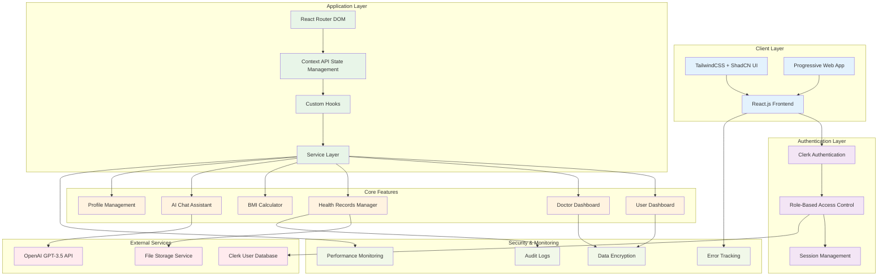

# 🏥 Bharat Health - Digital Healthcare Management System

> A comprehensive digital healthcare platform designed to revolutionize health record management in India, featuring AI-powered assistance, role-based access control, and seamless doctor-patient interactions.

[](https://opensource.org/licenses/MIT)
[](https://github.com/Shreyyy07/bharat-health)
[](https://github.com/Shreyyy07/bharat-health)
[](https://reactjs.org/)
[](https://tailwindcss.com/)

## 🌟 Overview

Bharat Health is a revolutionary digital healthcare management system designed specifically for the Indian healthcare ecosystem. Our platform bridges the gap between traditional healthcare practices and modern digital solutions, providing secure, accessible, and comprehensive health record management for patients and healthcare providers across India.

### 🎯 Mission Statement
*"Empowering every Indian with secure, accessible, and comprehensive digital healthcare records while facilitating seamless doctor-patient interactions through cutting-edge AI technology."*

### 🚀 Why Bharat Health?

- **🔒 Privacy First**: Bank-grade security with end-to-end encryption
- **🌐 Universal Access**: Available 24/7 from anywhere in India
- **🤖 AI-Powered**: Intelligent health insights and recommendations
- **👨‍⚕️ Doctor-Friendly**: Specialized tools for healthcare professionals
- **📱 Mobile-Ready**: Responsive design for all devices
- **🏥 Scalable**: Built to serve millions of users across India

## 🏗️ System Architecture



## ✨ Core Features

### 🔐 Advanced Authentication System
- **Multi-Factor Authentication**: Enhanced security with SMS/Email verification
- **Biometric Login**: Fingerprint and Face ID support (mobile)
- **Role-Based Access Control**: Distinct permissions for patients, doctors, and administrators
- **Session Persistence**: Seamless experience across devices and sessions
- **Profile Customization**: Comprehensive profile setup with photo upload

### 👥 User Management
- **Patient Portal**: Comprehensive health record management
- **Doctor Portal**: Professional dashboard with patient management tools
- **Admin Panel**: System administration and user oversight
- **Guest Access**: Limited functionality for emergency situations

### 🏥 Health Records Management
- **Digital Medical Records**: Complete digitization of health documents
- **Prescription Management**: Track medications and dosages
- **Test Results Integration**: Lab reports and diagnostic results
- **Appointment History**: Complete medical visit timeline
- **Emergency Information**: Quick access to critical health data

### 🤖 AI-Powered Health Assistant
- **Natural Language Processing**: ChatGPT-like conversational interface
- **Health Query Resolution**: Instant answers to health-related questions
- **Symptom Analysis**: Preliminary assessment of health symptoms
- **Medication Information**: Drug interactions and side effects
- **Health Tips & Recommendations**: Personalized wellness advice

### 📊 Health Analytics
- **BMI Calculator**: Body Mass Index calculation with health insights
- **Health Trends**: Visual representation of health metrics over time
- **Risk Assessment**: AI-powered health risk evaluation
- **Progress Tracking**: Monitor health improvements and goals
- **Comparative Analysis**: Benchmarking against health standards

### 👨‍⚕️ Doctor Tools
- **Patient Management**: Comprehensive patient database
- **Appointment Scheduling**: Integrated calendar system
- **Prescription Writer**: Digital prescription generation
- **Medical Notes**: Secure note-taking during consultations
- **Report Analysis**: AI-assisted medical report interpretation

## 🛠️ Technology Stack

### Frontend Technologies
```json
{
  "framework": "React.js 18.2+",
  "styling": "TailwindCSS 3.3+",
  "components": "ShadCN UI",
  "routing": "React Router DOM 6.8+",
  "state": "Context API + useReducer",
  "build": "Vite 4.0+",
  "pwa": "Workbox Service Worker"
}
```

### Authentication & Security
```json
{
  "auth_provider": "Clerk.dev",
  "encryption": "AES-256",
  "ssl_tls": "TLS 1.3",
  "csrf_protection": "Built-in",
  "rate_limiting": "Custom middleware"
}
```

### External Integrations
```json
{
  "ai_service": "OpenAI GPT-3.5 Turbo",
  "file_storage": "Cloudinary/AWS S3",
  "analytics": "Google Analytics 4",
  "monitoring": "Sentry Error Tracking"
}
```

## 🚀 Getting Started

### Prerequisites

Before you begin, ensure you have the following installed:
- **Node.js** (v18.0 or higher)
- **npm** or **yarn** package manager
- **Git** for version control
- **Modern web browser** (Chrome, Firefox, Safari, Edge)

### Quick Installation

1. **Clone the Repository**
```bash
git clone https://github.com/Shreyyy07/bharat-health.git
cd bharat-health
```

2. **Install Dependencies**
```bash
# Using npm
npm install

# Using yarn
yarn install
```

3. **Environment Configuration**
```bash
# Copy the environment template
cp .env.example .env

# Edit the environment file
nano .env
```

4. **Configure Environment Variables**
```env
# Application Settings
VITE_APP_NAME=Bharat Health
VITE_APP_VERSION=1.0.0
VITE_APP_ENVIRONMENT=development

# Clerk Authentication
VITE_CLERK_PUBLISHABLE_KEY=pk_test_your_clerk_publishable_key
VITE_CLERK_FRONTEND_API=your_clerk_frontend_api_key
VITE_CLERK_AFTER_SIGN_IN_URL=/dashboard
VITE_CLERK_AFTER_SIGN_UP_URL=/onboarding

# OpenAI Configuration
VITE_OPENAI_API_KEY=sk-your_openai_api_key
VITE_OPENAI_MODEL=gpt-3.5-turbo
VITE_OPENAI_MAX_TOKENS=150

# Feature Flags
VITE_ENABLE_AI_ASSISTANT=true
VITE_ENABLE_DOCTOR_PORTAL=true
VITE_ENABLE_ANALYTICS=true

# API Endpoints
VITE_API_BASE_URL=http://localhost:3000/api
VITE_WEBSOCKET_URL=ws://localhost:3001

# Security
VITE_ENCRYPTION_KEY=your_encryption_key_here
```

5. **Start Development Server**
```bash
# Using npm
npm run dev

# Using yarn
yarn dev
```

6. **Access the Application**
```
🌐 Frontend: http://localhost:5173
📊 Analytics: http://localhost:5173/analytics
🔧 Admin Panel: http://localhost:5173/admin
```

## 🔒 Security Features

### Data Protection
- **End-to-End Encryption**: All health data encrypted in transit and at rest
- **HIPAA Compliance**: Adherence to healthcare privacy standards
- **Access Controls**: Role-based permissions with least privilege principle
- **Audit Logging**: Comprehensive activity tracking and monitoring
- **Data Anonymization**: PII protection in analytics and logs

## 🤝 Contributing

We welcome contributions from the developer community! Please read our [Contributing Guide](CONTRIBUTING.md) for detailed information.

### Development Setup
1. Fork the repository
2. Create a feature branch: `git checkout -b feature/amazing-feature`
3. Install dependencies: `npm install`
4. Make your changes
5. Run tests: `npm test`
6. Commit changes: `git commit -m 'Add amazing feature'`
7. Push to branch: `git push origin feature/amazing-feature`
8. Open a Pull Request

### Code Style Guidelines
- Follow ESLint configuration
- Use Prettier for code formatting
- Write comprehensive tests for new features
- Document all public APIs
- Follow semantic commit messages

### Issue Templates
- **🐛 Bug Report**: Report application bugs
- **✨ Feature Request**: Suggest new features
- **📖 Documentation**: Improve documentation
- **🔧 Enhancement**: Improve existing features

## 📈 Analytics & Monitoring

### Key Performance Indicators (KPIs)
- **User Engagement**: Daily/Monthly active users
- **Feature Adoption**: AI assistant usage, record creation
- **Performance Metrics**: Page load times, error rates
- **User Satisfaction**: NPS scores, user feedback
- **Medical Outcomes**: Health improvement tracking

## 📄 License

This project is licensed under the MIT License - see the [LICENSE](LICENSE) file for details.

```
MIT License

Copyright (c) 2025 Shrey Joshi

Permission is hereby granted, free of charge, to any person obtaining a copy
of this software and associated documentation files (the "Software"), to deal
in the Software without restriction, including without limitation the rights
to use, copy, modify, merge, publish, distribute, sublicense, and/or sell
copies of the Software, and to permit persons to whom the Software is
furnished to do so, subject to the following conditions:

The above copyright notice and this permission notice shall be included in all
copies or substantial portions of the Software.

THE SOFTWARE IS PROVIDED "AS IS", WITHOUT WARRANTY OF ANY KIND, EXPRESS OR
IMPLIED, INCLUDING BUT NOT LIMITED TO THE WARRANTIES OF MERCHANTABILITY,
FITNESS FOR A PARTICULAR PURPOSE AND NONINFRINGEMENT. IN NO EVENT SHALL THE
AUTHORS OR COPYRIGHT HOLDERS BE LIABLE FOR ANY CLAIM, DAMAGES OR OTHER
LIABILITY, WHETHER IN AN ACTION OF CONTRACT, TORT OR OTHERWISE, ARISING FROM,
OUT OF OR IN CONNECTION WITH THE SOFTWARE OR THE USE OR OTHER DEALINGS IN
THE SOFTWARE.
```

## 🙏 Acknowledgments

- **OpenAI**: For providing GPT-3.5 API for our AI assistant
- **Clerk**: For robust authentication infrastructure
- **TailwindCSS**: For beautiful and responsive styling
- **React Community**: For the amazing ecosystem and tools
- **Healthcare Professionals**: For guidance on medical requirements
- **Open Source Contributors**: For continuous improvements and feedback

---

**🚀 Ready to revolutionize healthcare in India?**

**Built with ❤️ by [Shrey Joshi](https://github.com/Shreyyy07)**

*Let's digitize healthcare together and make quality medical care accessible to every Indian!*

---
